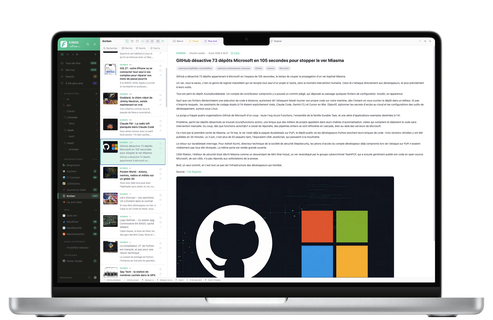
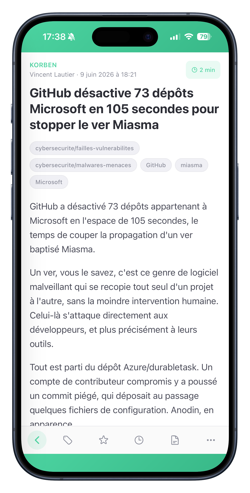
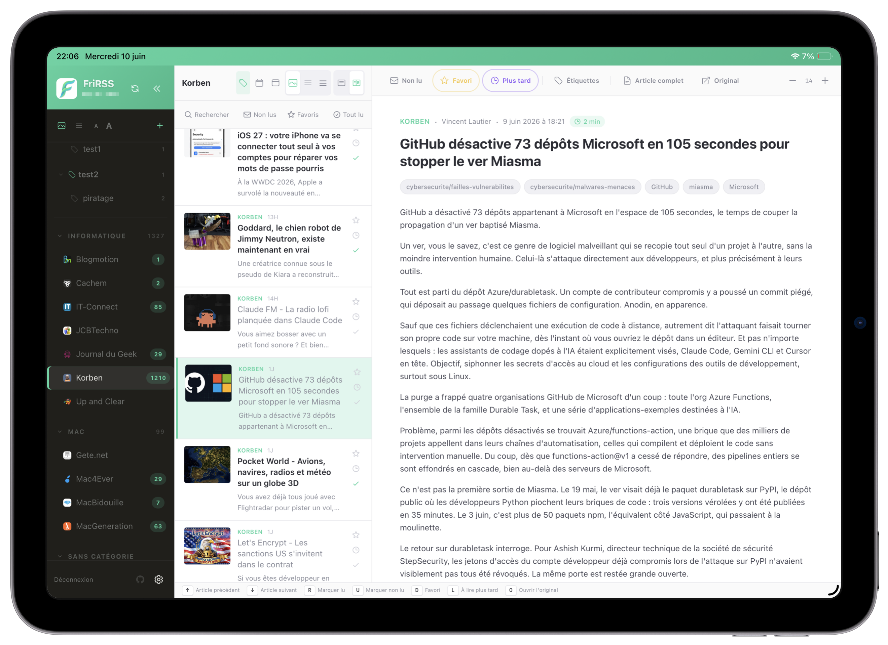

<div align="center">
  
  <h1>FriRSS</h1>
  <p><em>Your FriRSS, your rules.</em></p>
  <p>A self-hosted, customizable web frontend for <a href="https://freshrss.org">FreshRSS</a>.</p>
  <p>
    <a href="LICENSE"></a>
    <a href="https://github.com/Fripix/frirss/actions/workflows/ci.yml"></a>
    <a href="https://github.com/Fripix/frirss/pkgs/container/frirss"></a>
  </p>
</div>

<div align="center">
  
</div>
<div align="center">
  
  &nbsp;&nbsp;
  
</div>

## About

[FreshRSS](https://freshrss.org) has an excellent engine: solid, self-hosted, great at fetching and storing feeds. Its built-in interface just wasn't for me, and none of the alternatives fit what I wanted — so I built my own. FriRSS sits on top of FreshRSS through its Google Reader API and replaces only the interface.

A note in the interest of honesty: this is a personal project and I'm not a developer. FriRSS was built largely by "vibe coding" — describing what I wanted to an AI assistant and iterating. Use it in that spirit.

## Features

- **Three-pane reader** on desktop, and an installable **PWA** on mobile with swipe navigation, swipe actions and pull-to-refresh.
- **Full-text extraction** (Readability) when a feed only ships a summary, cached so re-reads are instant.
- **Organize freely**: favorites, read-later, nestable colored labels with per-label counts, and drag-and-drop ordering of feeds and categories.
- **Themes**: full control over colors and fonts, with import/export and saved themes. Set your own app name and logo.
- **Multi-user** with admin/user roles — each person keeps their own feeds and settings.
- **Single sign-on** via OIDC (tested with [Authentik](https://goauthentik.io)): existing accounts are linked by email, and passkeys work through your provider.
- **Multi-server**: connect several FreshRSS instances and switch between them.
- **Built to self-host**: optional Redis cache with background pre-fetch, FreshRSS tokens encrypted at rest, an anti-SSRF proxy, a single Docker image, and a UI in 9 languages.

## Installation

FriRSS is a frontend for FreshRSS, so you need a running FreshRSS instance with the Google Reader API enabled (*Settings → Authentication → Allow API access*).

```bash
mkdir -p frirss-data
docker run -d --name frirss \
  -p 8080:80 \
  -v "$PWD/frirss-data:/app/data" \
  -e TZ=Europe/Zurich \
  ghcr.io/fripix/frirss:latest
```

Open `http://localhost:8080`, create the first account (it becomes admin), then connect your FreshRSS server: its URL, your FreshRSS username, and the API password (set in *FreshRSS → Settings → Profile*).

Prefer Compose? A ready-to-edit [`docker-compose.yml`](docker-compose.yml) is included. The first launch generates the JWT secret and the token-encryption key and stores them in the SQLite database, so backing up the data volume backs up everything.

## Configuration

| Variable | Description | Default |
|---|---|---|
| `FRIRSS_BASE_URL` | Public base URL — recommended behind a reverse proxy; fixes OIDC redirect URIs | derived |
| `FRIRSS_DATA_DIR` | SQLite database directory | `/app/data` |
| `PROXY_REWRITES` | public→internal URL rewrites for the backend proxy (`from=to`, comma-separated) | — |
| `PROXY_INTERNAL_HOSTS` | Anti-SSRF allowlist: internal hosts the proxy may reach directly | — |
| `REDIS_URL` | Enables the read cache (stale-while-revalidate); empty disables it | — |
| `CACHE_ARTICLES_PER_FEED` | Articles kept per feed in the cache | `50` |
| `CACHE_TTL` | Cache key expiry, in seconds | `86400` |
| `CACHE_SYNC_INTERVAL` | Background pre-fetch interval in minutes (`0` disables; needs `REDIS_URL`) | `0` |
| `CORS_ORIGIN` | Allowed CORS origin(s) — only for split front/back deployments | — |

Single sign-on is configured at runtime in *Preferences → Admin → SSO* (issuer, client ID, client secret).

## License

[MIT](LICENSE)
